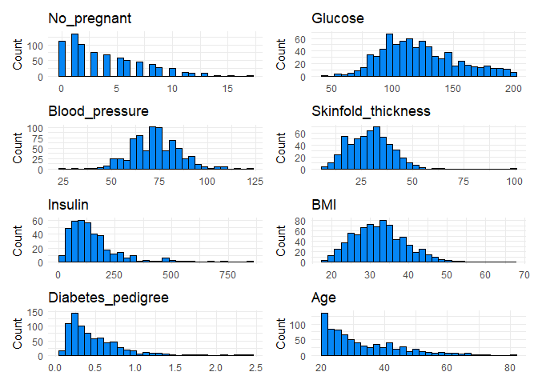
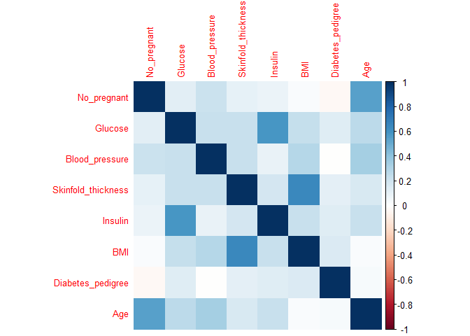
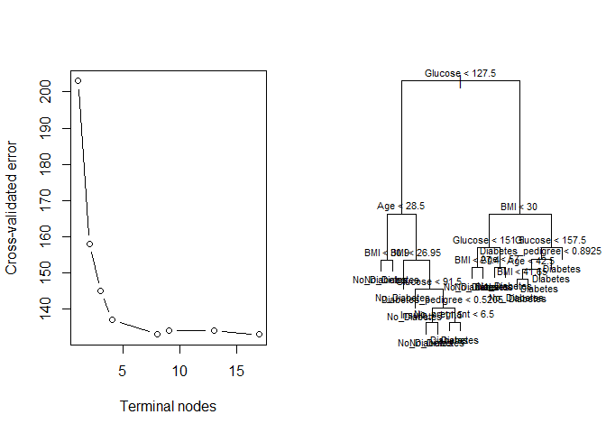
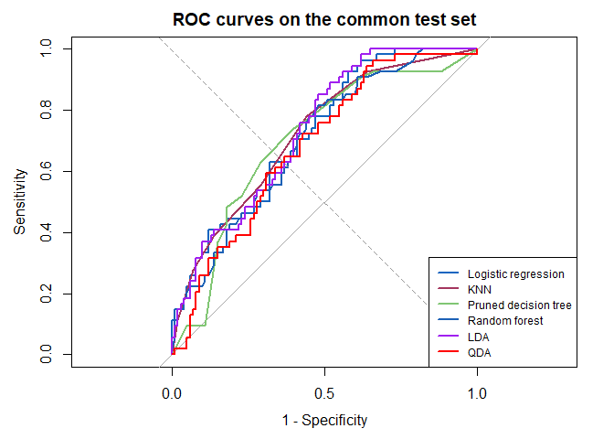

# Diabetes Classification
George Oikonomidis

- [Libraries](#libraries)
- [Data preparation](#data-preparation)
- [Exploratory analysis](#exploratory-analysis)
- [Common training and test split](#common-training-and-test-split)
- [Model 1: logistic regression](#model-1-logistic-regression)
- [Model 2: K-nearest neighbours](#model-2-k-nearest-neighbours)
- [Model 3: decision tree](#model-3-decision-tree)
- [Model 4: random forest](#model-4-random-forest)
- [Model 5: linear discriminant
  analysis](#model-5-linear-discriminant-analysis)
- [Model 6: quadratic discriminant
  analysis](#model-6-quadratic-discriminant-analysis)
- [Test-set evaluation](#test-set-evaluation)
- [Sensitivity analysis: imputation versus complete
  cases](#sensitivity-analysis-imputation-versus-complete-cases)
- [Conclusion](#conclusion)

## Libraries

``` r
set.seed(125)

library(dplyr)
library(ggplot2)
library(patchwork)
library(rsample)
library(caret)
library(tree)
library(randomForest)
library(pROC)
library(class)
library(corrplot)
library(MASS)
```

## Data preparation

The dataset contains 768 observations and eight predictors. Zero is
retained for the number of pregnancies, but it is treated as a missing
measurement for glucose, blood pressure, skinfold thickness, insulin,
and BMI.

``` r
diabetes <- read.csv(
  "data/pima_diabetes.csv",
  header = FALSE,
  col.names = c(
    "No_pregnant", "Glucose", "Blood_pressure",
    "Skinfold_thickness", "Insulin", "BMI",
    "Diabetes_pedigree", "Age", "Class"
  )
)

diabetes$row_id <- seq_len(nrow(diabetes))
diabetes$Class <- factor(
  diabetes$Class,
  levels = c(0, 1),
  labels = c("No_Diabetes", "Diabetes")
)

missing_predictors <- c(
  "Glucose", "Blood_pressure", "Skinfold_thickness",
  "Insulin", "BMI"
)

diabetes[missing_predictors] <- lapply(
  diabetes[missing_predictors],
  function(x) replace(x, x == 0, NA)
)

data.frame(
  observations = nrow(diabetes),
  diabetes = sum(diabetes$Class == "Diabetes"),
  no_diabetes = sum(diabetes$Class == "No_Diabetes")
)
```

      observations diabetes no_diabetes
    1          768      268         500

``` r
sapply(diabetes[missing_predictors], function(x) sum(is.na(x)))
```

               Glucose     Blood_pressure Skinfold_thickness            Insulin 
                     5                 35                227                374 
                   BMI 
                    11 

## Exploratory analysis

``` r
predictor_names <- setdiff(names(diabetes), c("Class", "row_id"))

plots <- lapply(predictor_names, function(variable) {
  ggplot(diabetes, aes(x = .data[[variable]])) +
    geom_histogram(color = "black", fill = "#0586F5", bins = 30) +
    theme_minimal() +
    labs(title = variable, x = NULL, y = "Count")
})

wrap_plots(plots, ncol = 2)
```



``` r
correlation_matrix <- cor(
  diabetes[predictor_names],
  use = "pairwise.complete.obs"
)

corrplot(correlation_matrix, method = "color", tl.cex = 0.8)
```



## Common training and test split

All models use the same stratified 80/20 split. The seed is set before
splitting. Missing-value medians are estimated from the training data
only and then applied unchanged to the test data.

``` r
set.seed(125)
data_split <- initial_split(diabetes, prop = 0.8, strata = Class)

training_raw <- training(data_split)
test_raw <- testing(data_split)

training_data <- training_raw
test_data <- test_raw

training_medians <- sapply(
  training_data[missing_predictors],
  median,
  na.rm = TRUE
)

for (variable in missing_predictors) {
  training_data[[variable]][is.na(training_data[[variable]])] <-
    training_medians[[variable]]
  test_data[[variable]][is.na(test_data[[variable]])] <-
    training_medians[[variable]]
}

training_data$row_id <- NULL
test_data$row_id <- NULL

data.frame(
  split = c("Training", "Test"),
  observations = c(nrow(training_data), nrow(test_data)),
  diabetes = c(
    sum(training_data$Class == "Diabetes"),
    sum(test_data$Class == "Diabetes")
  ),
  no_diabetes = c(
    sum(training_data$Class == "No_Diabetes"),
    sum(test_data$Class == "No_Diabetes")
  )
)
```

         split observations diabetes no_diabetes
    1 Training          614      214         400
    2     Test          154       54         100

The test set is not used for preprocessing, feature selection, model
tuning, pruning, or threshold selection.

## Model 1: logistic regression

The predictor subset follows the original assignment. Repeated
cross-validation is performed only inside the training set.

``` r
model_control <- trainControl(
  method = "repeatedcv",
  number = 6,
  repeats = 1,
  classProbs = TRUE,
  savePredictions = "final"
)

logistic_formula <- Class ~ Glucose + Blood_pressure +
  Diabetes_pedigree + BMI + Age

set.seed(125)
logistic_model <- train(
  logistic_formula,
  data = training_data,
  method = "glm",
  family = binomial,
  metric = "Accuracy",
  trControl = model_control
)

summary(logistic_model$finalModel)
```


    Call:
    NULL

    Coefficients:
                        Estimate Std. Error z value Pr(>|z|)    
    (Intercept)       -10.202108   0.977593 -10.436  < 2e-16 ***
    Glucose             0.041019   0.004277   9.591  < 2e-16 ***
    Blood_pressure     -0.010683   0.009815  -1.088 0.276375    
    Diabetes_pedigree   0.942296   0.353167   2.668 0.007628 ** 
    BMI                 0.108840   0.017777   6.123  9.2e-10 ***
    Age                 0.034836   0.009712   3.587 0.000335 ***
    ---
    Signif. codes:  0 '***' 0.001 '**' 0.01 '*' 0.05 '.' 0.1 ' ' 1

    (Dispersion parameter for binomial family taken to be 1)

        Null deviance: 793.94  on 613  degrees of freedom
    Residual deviance: 542.15  on 608  degrees of freedom
    AIC: 554.15

    Number of Fisher Scoring iterations: 5

``` r
logistic_probability <- predict(
  logistic_model,
  newdata = test_data,
  type = "prob"
)[, "Diabetes"]
```

## Model 2: K-nearest neighbours

KNN retains the original choice $k=6$. Training means and standard
deviations are used to transform both partitions, preventing information
from the test set from leaking into model fitting.

``` r
knn_predictors <- setdiff(names(training_data), "Class")

training_means <- sapply(training_data[knn_predictors], mean)
training_standard_deviations <- sapply(training_data[knn_predictors], sd)

training_knn <- scale(
  training_data[knn_predictors],
  center = training_means,
  scale = training_standard_deviations
)
test_knn <- scale(
  test_data[knn_predictors],
  center = training_means,
  scale = training_standard_deviations
)

set.seed(125)
knn_model <- knn(
  train = training_knn,
  test = test_knn,
  cl = training_data$Class,
  k = 6,
  prob = TRUE
)

knn_winning_probability <- attr(knn_model, "prob")
knn_probability <- ifelse(
  knn_model == "Diabetes",
  knn_winning_probability,
  1 - knn_winning_probability
)
```

## Model 3: decision tree

The tree is pruned using cross-validation on the training data. Pruning
is useful in small datasets because it can reduce variance.

``` r
set.seed(280)
tree_model <- tree(Class ~ ., data = training_data)

set.seed(280)
cv_tree_model <- cv.tree(
  tree_model,
  K = 10,
  FUN = prune.misclass
)

best_tree_size <- cv_tree_model$size[
  which.min(cv_tree_model$dev)
]
pruned_tree <- prune.misclass(tree_model, best = best_tree_size)

par(mfrow = c(1, 2))
plot(cv_tree_model$size, cv_tree_model$dev, type = "b",
     xlab = "Terminal nodes", ylab = "Cross-validated error")
plot(pruned_tree)
text(pruned_tree, pretty = 0, cex = 0.7)
```



``` r
par(mfrow = c(1, 1))

tree_probability <- predict(
  pruned_tree,
  newdata = test_data,
  type = "vector"
)[, "Diabetes"]
```

## Model 4: random forest

Feature selection and `mtry` tuning occur entirely inside training
resamples. The untouched test set is evaluated once after the final
forest has been selected.

``` r
rf_predictors <- setdiff(names(training_data), "Class")

rfe_control <- rfeControl(
  functions = rfFuncs,
  method = "cv",
  number = 6
)

set.seed(60)
rf_rfe <- rfe(
  x = training_data[rf_predictors],
  y = training_data$Class,
  sizes = seq_along(rf_predictors),
  rfeControl = rfe_control
)

selected_rf_predictors <- predictors(rf_rfe)
selected_rf_predictors
```

    [1] "Glucose"            "BMI"                "Age"               
    [4] "Insulin"            "No_pregnant"        "Diabetes_pedigree" 
    [7] "Skinfold_thickness" "Blood_pressure"    

``` r
rf_formula <- reformulate(
  selected_rf_predictors,
  response = "Class"
)

rf_tuning_grid <- data.frame(
  mtry = seq_len(length(selected_rf_predictors))
)

set.seed(60)
random_forest_model <- train(
  rf_formula,
  data = training_data,
  method = "rf",
  ntree = 160,
  metric = "Accuracy",
  tuneGrid = rf_tuning_grid,
  trControl = model_control,
  importance = TRUE
)

random_forest_model$bestTune
```

      mtry
    8    8

``` r
varImp(random_forest_model)
```

    rf variable importance

                       Importance
    Glucose                100.00
    BMI                     50.36
    Age                     30.67
    No_pregnant             20.05
    Insulin                 19.22
    Diabetes_pedigree       17.99
    Skinfold_thickness      12.61
    Blood_pressure           0.00

``` r
random_forest_probability <- predict(
  random_forest_model,
  newdata = test_data,
  type = "prob"
)[, "Diabetes"]
```

## Model 5: linear discriminant analysis

``` r
lda_model <- lda(Class ~ ., data = training_data)
lda_prediction <- predict(lda_model, test_data)
lda_probability <- lda_prediction$posterior[, "Diabetes"]

lda_model
```

    Call:
    lda(Class ~ ., data = training_data)

    Prior probabilities of groups:
    No_Diabetes    Diabetes 
      0.6514658   0.3485342 

    Group means:
                No_pregnant  Glucose Blood_pressure Skinfold_thickness  Insulin
    No_Diabetes    3.385000 109.3725        70.7725           27.80000 120.8550
    Diabetes       5.037383 143.5327        74.5514           31.84112 169.1168
                     BMI Diabetes_pedigree      Age
    No_Diabetes 30.57075         0.4212050 31.04250
    Diabetes    35.42804         0.5486262 37.23364

    Coefficients of linear discriminants:
                                 LD1
    No_pregnant         0.0858156835
    Glucose             0.0296942540
    Blood_pressure     -0.0069488910
    Skinfold_thickness -0.0044330359
    Insulin             0.0003143886
    BMI                 0.0705972197
    Diabetes_pedigree   0.5562902336
    Age                 0.0095724294

## Model 6: quadratic discriminant analysis

``` r
qda_model <- qda(Class ~ ., data = training_data)
qda_prediction <- predict(qda_model, test_data)
qda_probability <- qda_prediction$posterior[, "Diabetes"]

qda_model
```

    Call:
    qda(Class ~ ., data = training_data)

    Prior probabilities of groups:
    No_Diabetes    Diabetes 
      0.6514658   0.3485342 

    Group means:
                No_pregnant  Glucose Blood_pressure Skinfold_thickness  Insulin
    No_Diabetes    3.385000 109.3725        70.7725           27.80000 120.8550
    Diabetes       5.037383 143.5327        74.5514           31.84112 169.1168
                     BMI Diabetes_pedigree      Age
    No_Diabetes 30.57075         0.4212050 31.04250
    Diabetes    35.42804         0.5486262 37.23364

## Test-set evaluation

The classification threshold is fixed at 0.50 before inspecting test
performance. Every metric below is generated from the same test
observations and the same fitted model objects.

``` r
test_probabilities <- list(
  `Logistic regression` = logistic_probability,
  KNN = knn_probability,
  `Pruned decision tree` = tree_probability,
  `Random forest` = random_forest_probability,
  LDA = lda_probability,
  QDA = qda_probability
)

class_from_probability <- function(probability, threshold = 0.50) {
  factor(
    ifelse(probability >= threshold, "Diabetes", "No_Diabetes"),
    levels = levels(test_data$Class)
  )
}

test_classes <- lapply(
  test_probabilities,
  class_from_probability,
  threshold = 0.50
)

confusion_matrices <- lapply(
  test_classes,
  confusionMatrix,
  reference = test_data$Class,
  positive = "Diabetes"
)

lapply(confusion_matrices, function(result) result$table)
```

    $`Logistic regression`
                 Reference
    Prediction    No_Diabetes Diabetes
      No_Diabetes          75       29
      Diabetes             25       25

    $KNN
                 Reference
    Prediction    No_Diabetes Diabetes
      No_Diabetes          71       24
      Diabetes             29       30

    $`Pruned decision tree`
                 Reference
    Prediction    No_Diabetes Diabetes
      No_Diabetes          77       26
      Diabetes             23       28

    $`Random forest`
                 Reference
    Prediction    No_Diabetes Diabetes
      No_Diabetes          68       25
      Diabetes             32       29

    $LDA
                 Reference
    Prediction    No_Diabetes Diabetes
      No_Diabetes          76       28
      Diabetes             24       26

    $QDA
                 Reference
    Prediction    No_Diabetes Diabetes
      No_Diabetes          74       32
      Diabetes             26       22

False positives and false negatives are taken from `confusionMatrix()`
with `Diabetes` explicitly declared as the positive class.

``` r
average_precision <- function(actual, probability) {
  positive <- actual == "Diabetes"
  ordering <- order(probability, decreasing = TRUE)
  positive <- positive[ordering]

  precision <- cumsum(positive) / seq_along(positive)
  sum(precision[positive]) / sum(positive)
}

evaluation_rows <- lapply(names(test_probabilities), function(model_name) {
  confusion <- confusion_matrices[[model_name]]
  probability <- test_probabilities[[model_name]]

  roc_object <- roc(
    response = test_data$Class,
    predictor = probability,
    levels = c("No_Diabetes", "Diabetes"),
    direction = "<",
    quiet = TRUE
  )

  data.frame(
    Model = model_name,
    Accuracy = unname(confusion$overall["Accuracy"]),
    Misclassification = 1 - unname(confusion$overall["Accuracy"]),
    Sensitivity = unname(confusion$byClass["Sensitivity"]),
    Specificity = unname(confusion$byClass["Specificity"]),
    Balanced_Accuracy = unname(confusion$byClass["Balanced Accuracy"]),
    ROC_AUC = as.numeric(auc(roc_object)),
    PR_AUC = average_precision(test_data$Class, probability)
  )
})

evaluation_results <- bind_rows(evaluation_rows)
evaluation_results[order(-evaluation_results$ROC_AUC), ]
```

                     Model  Accuracy Misclassification Sensitivity Specificity
    5                  LDA 0.6623377         0.3376623   0.4814815        0.76
    2                  KNN 0.6558442         0.3441558   0.5555556        0.71
    1  Logistic regression 0.6493506         0.3506494   0.4629630        0.75
    4        Random forest 0.6298701         0.3701299   0.5370370        0.68
    3 Pruned decision tree 0.6818182         0.3181818   0.5185185        0.77
    6                  QDA 0.6233766         0.3766234   0.4074074        0.74
      Balanced_Accuracy   ROC_AUC    PR_AUC
    5         0.6207407 0.7318519 0.5885745
    2         0.6327778 0.7220370 0.5923050
    1         0.6064815 0.7218519 0.5969452
    4         0.6085185 0.7009259 0.5611771
    3         0.6442593 0.7006481 0.5091370
    6         0.5737037 0.6827778 0.4828961

Here PR-AUC is calculated as average precision. It complements ROC-AUC
when the positive class is less frequent.

``` r
roc_objects <- lapply(test_probabilities, function(probability) {
  roc(
    test_data$Class,
    probability,
    levels = c("No_Diabetes", "Diabetes"),
    direction = "<",
    quiet = TRUE
  )
})

model_colours <- c(
  "#1565C0", "#A4365E", "#80C673",
  "#1C61B6", "purple", "red"
)

plot(
  roc_objects[[1]],
  col = model_colours[1],
  lwd = 2,
  legacy.axes = TRUE,
  main = "ROC curves on the common test set"
)

for (i in 2:length(roc_objects)) {
  plot(
    roc_objects[[i]],
    col = model_colours[i],
    lwd = 2,
    add = TRUE,
    legacy.axes = TRUE
  )
}

abline(a = 0, b = 1, lty = 2, col = "grey60")
legend(
  "bottomright",
  legend = names(roc_objects),
  col = model_colours,
  lwd = 2,
  cex = 0.75
)
```



For a clinical application, the 0.50 threshold should not be treated as
universally optimal. A sensitivity-oriented threshold must be chosen
using training/CV predictions and explicit clinical costs, followed by
one final evaluation on untouched data.

## Sensitivity analysis: imputation versus complete cases

The original complete-case rule removes every row with at least one
implausible zero. The comparison below repeats the logistic analysis on
complete cases while preserving the original common split. This shows
how much information the deletion rule discards.

``` r
complete_training <- training_raw[
  complete.cases(training_raw[missing_predictors]),
]
complete_test <- test_raw[
  complete.cases(test_raw[missing_predictors]),
]

complete_training$row_id <- NULL
complete_test$row_id <- NULL

complete_case_model <- glm(
  logistic_formula,
  data = complete_training,
  family = binomial
)

complete_case_probability <- predict(
  complete_case_model,
  newdata = complete_test,
  type = "response"
)

imputed_probability_same_rows <- predict(
  logistic_model,
  newdata = complete_test,
  type = "prob"
)[, "Diabetes"]

complete_case_roc <- roc(
  complete_test$Class,
  complete_case_probability,
  levels = c("No_Diabetes", "Diabetes"),
  direction = "<",
  quiet = TRUE
)
imputed_same_rows_roc <- roc(
  complete_test$Class,
  imputed_probability_same_rows,
  levels = c("No_Diabetes", "Diabetes"),
  direction = "<",
  quiet = TRUE
)

data.frame(
  analysis = c("Train-only median imputation", "Complete cases"),
  training_observations = c(nrow(training_data), nrow(complete_training)),
  test_observations_for_comparison = nrow(complete_test),
  ROC_AUC_on_complete_test_rows = c(
    as.numeric(auc(imputed_same_rows_roc)),
    as.numeric(auc(complete_case_roc))
  )
)
```

                          analysis training_observations
    1 Train-only median imputation                   614
    2               Complete cases                   316
      test_observations_for_comparison ROC_AUC_on_complete_test_rows
    1                               76                     0.7375000
    2                               76                     0.7392857

## Conclusion

The original sequence—logistic regression, KNN, decision tree, random
forest, LDA, QDA, and ROC comparison—is retained. The corrections ensure
a common split, train-only preprocessing and tuning, correctly oriented
class metrics, reproducibility, transparent thresholding, and a fair
sensitivity analysis for the missing-data decision. The study is
educational and is not a clinical decision tool.
