# Prostate Cancer Clustering
George Oikonomidis

- [Libraries](#libraries)
- [Data preparation](#data-preparation)
- [Exploratory analysis](#exploratory-analysis)
- [Hierarchical clustering with Manhattan
  distance](#hierarchical-clustering-with-manhattan-distance)
- [Hierarchical clustering with Euclidean
  distance](#hierarchical-clustering-with-euclidean-distance)
- [Cluster profiles for hierarchical
  solutions](#cluster-profiles-for-hierarchical-solutions)
- [K-means clustering](#k-means-clustering)
- [Gap statistic](#gap-statistic)
- [Model-based clustering](#model-based-clustering)
- [Principal component analysis](#principal-component-analysis)
- [Internal evaluation](#internal-evaluation)
- [Agreement between clustering
  solutions](#agreement-between-clustering-solutions)
- [External comparison with
  diagnosis](#external-comparison-with-diagnosis)
- [Cluster descriptions](#cluster-descriptions)
- [Sensitivity analysis: standard versus robust
  scaling](#sensitivity-analysis-standard-versus-robust-scaling)
- [Conclusion](#conclusion)

## Libraries

``` r
set.seed(125)

library(dplyr)
library(ggplot2)
library(patchwork)
library(cluster)
library(factoextra)
library(mclust)
library(reshape2)
```

## Data preparation

The diagnosis label is withheld from clustering and used only for
external evaluation. All eight continuous measurements remain
continuous.

``` r
prostate <- read.csv("data/prostate_cancer.csv", header = TRUE)
prostate$diagnosis_result <- factor(
  prostate$diagnosis_result,
  levels = c("B", "M"),
  labels = c("Benign", "Malignant")
)

clustering_variables <- c(
  "radius", "texture", "perimeter", "area",
  "smoothness", "compactness", "symmetry",
  "fractal_dimension"
)

clustering_data <- prostate[clustering_variables]

for (variable in clustering_variables) {
  if (anyNA(clustering_data[[variable]])) {
    clustering_data[[variable]][is.na(clustering_data[[variable]])] <-
      median(clustering_data[[variable]], na.rm = TRUE)
  }
}

data.frame(
  observations = nrow(clustering_data),
  benign = sum(prostate$diagnosis_result == "Benign"),
  malignant = sum(prostate$diagnosis_result == "Malignant")
)
```

      observations benign malignant
    1          100     38        62

``` r
str(clustering_data)
```

    'data.frame':   100 obs. of  8 variables:
     $ radius           : int  23 9 21 14 9 25 16 15 19 25 ...
     $ texture          : int  12 13 27 16 19 25 26 18 24 11 ...
     $ perimeter        : int  151 133 130 78 135 83 120 90 88 84 ...
     $ area             : int  954 1326 1203 386 1297 477 1040 578 520 476 ...
     $ smoothness       : num  0.143 0.143 0.125 0.07 0.141 0.128 0.095 0.119 0.127 0.119 ...
     $ compactness      : num  0.278 0.079 0.16 0.284 0.133 0.17 0.109 0.165 0.193 0.24 ...
     $ symmetry         : num  0.242 0.181 0.207 0.26 0.181 0.209 0.179 0.22 0.235 0.203 ...
     $ fractal_dimension: num  0.079 0.057 0.06 0.097 0.059 0.076 0.057 0.075 0.074 0.082 ...

## Exploratory analysis

``` r
histograms <- lapply(clustering_variables, function(variable) {
  ggplot(clustering_data, aes(x = .data[[variable]])) +
    geom_histogram(color = "black", fill = "#8C87B4", bins = 30) +
    theme_minimal() +
    labs(title = variable, x = NULL, y = "Count")
})

wrap_plots(histograms, ncol = 2)
```

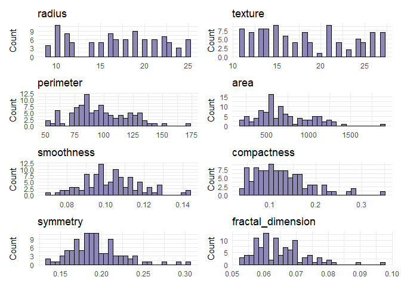

``` r
boxplots <- lapply(clustering_variables, function(variable) {
  ggplot(clustering_data, aes(y = .data[[variable]])) +
    geom_boxplot(fill = "#8C87B4", outlier.colour = "red") +
    theme_minimal() +
    labs(title = variable, x = NULL, y = NULL)
})

wrap_plots(boxplots, ncol = 4)
```

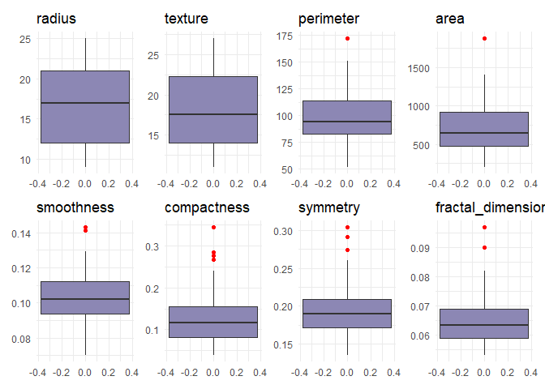

The IQR rule is used to identify potential outliers, not to replace them
with column means.

``` r
outlier_summary <- lapply(clustering_variables, function(variable) {
  values <- clustering_data[[variable]]
  first_quartile <- quantile(values, 0.25)
  third_quartile <- quantile(values, 0.75)
  interquartile_range <- third_quartile - first_quartile
  lower_limit <- first_quartile - 1.5 * interquartile_range
  upper_limit <- third_quartile + 1.5 * interquartile_range
  outliers <- values[values < lower_limit | values > upper_limit]

  data.frame(
    Variable = variable,
    Number_of_outliers = length(outliers),
    Outlier_values = paste(outliers, collapse = ", ")
  )
})

bind_rows(outlier_summary)
```

               Variable Number_of_outliers             Outlier_values
    1            radius                  0                           
    2           texture                  0                           
    3         perimeter                  1                        172
    4              area                  1                       1878
    5        smoothness                  3        0.143, 0.143, 0.141
    6       compactness                  4 0.278, 0.284, 0.345, 0.267
    7          symmetry                  3        0.304, 0.274, 0.291
    8 fractal_dimension                  2                0.097, 0.09

``` r
original_scale_data <- clustering_data
standardised_data <- scale(clustering_data)
```

## Hierarchical clustering with Manhattan distance

Single, complete, and average linkage are retained for Manhattan
distance. Ward clustering is deliberately excluded because its
minimum-variance interpretation requires squared Euclidean geometry.

``` r
manhattan_distance <- dist(standardised_data, method = "manhattan")

single_manhattan <- hclust(manhattan_distance, method = "single")
complete_manhattan <- hclust(manhattan_distance, method = "complete")
average_manhattan <- hclust(manhattan_distance, method = "average")

par(mfrow = c(1, 3))
plot(single_manhattan, main = "Single linkage", sub = "Manhattan",
     xlab = "", cex = 0.6)
plot(complete_manhattan, main = "Complete linkage", sub = "Manhattan",
     xlab = "", cex = 0.6)
plot(average_manhattan, main = "Average linkage", sub = "Manhattan",
     xlab = "", cex = 0.6)
```

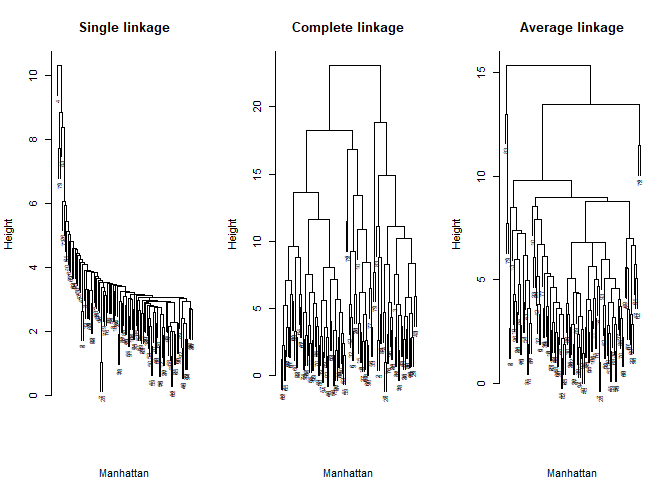

``` r
par(mfrow = c(1, 1))

cluster_complete_manhattan <- cutree(complete_manhattan, k = 3)
table(
  Cluster = cluster_complete_manhattan,
  Diagnosis = prostate$diagnosis_result
)
```

           Diagnosis
    Cluster Benign Malignant
          1      0         2
          2      2        28
          3     36        32

## Hierarchical clustering with Euclidean distance

The Euclidean comparison retains single, complete, average, centroid,
and Ward.D2 linkage. `ward.D2` is used for the minimum-variance
solution.

``` r
euclidean_distance <- dist(standardised_data, method = "euclidean")

single_euclidean <- hclust(euclidean_distance, method = "single")
complete_euclidean <- hclust(euclidean_distance, method = "complete")
average_euclidean <- hclust(euclidean_distance, method = "average")
centroid_euclidean <- hclust(euclidean_distance, method = "centroid")
ward_euclidean <- hclust(euclidean_distance, method = "ward.D2")

par(mfrow = c(2, 3))
plot(single_euclidean, main = "Single linkage", sub = "Euclidean",
     xlab = "", cex = 0.6)
plot(complete_euclidean, main = "Complete linkage", sub = "Euclidean",
     xlab = "", cex = 0.6)
plot(average_euclidean, main = "Average linkage", sub = "Euclidean",
     xlab = "", cex = 0.6)
plot(centroid_euclidean, main = "Centroid linkage", sub = "Euclidean",
     xlab = "", cex = 0.6)
plot(ward_euclidean, main = "Ward.D2", sub = "Euclidean",
     xlab = "", cex = 0.6)
plot.new()
```

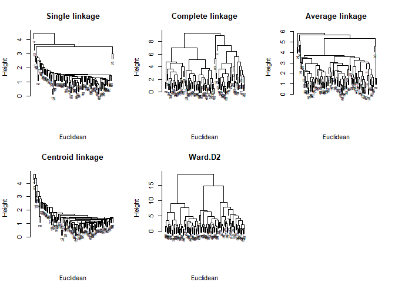

``` r
par(mfrow = c(1, 1))

cluster_complete_euclidean <- cutree(complete_euclidean, k = 3)
cluster_ward_euclidean <- cutree(ward_euclidean, k = 3)

table(
  Cluster = cluster_ward_euclidean,
  Diagnosis = prostate$diagnosis_result
)
```

           Diagnosis
    Cluster Benign Malignant
          1     10        22
          2      2        23
          3     26        17

## Cluster profiles for hierarchical solutions

``` r
plot_cluster_boxplots <- function(groups, title_prefix) {
  par(mfrow = c(2, 4))

  for (i in seq_along(clustering_variables)) {
    boxplot(
      original_scale_data[[i]] ~ factor(groups),
      col = rainbow(3),
      main = paste(title_prefix, clustering_variables[i]),
      xlab = "Cluster",
      ylab = ""
    )
  }

  par(mfrow = c(1, 1))
}

plot_cluster_boxplots(
  cluster_complete_manhattan,
  "Complete Manhattan:"
)
```

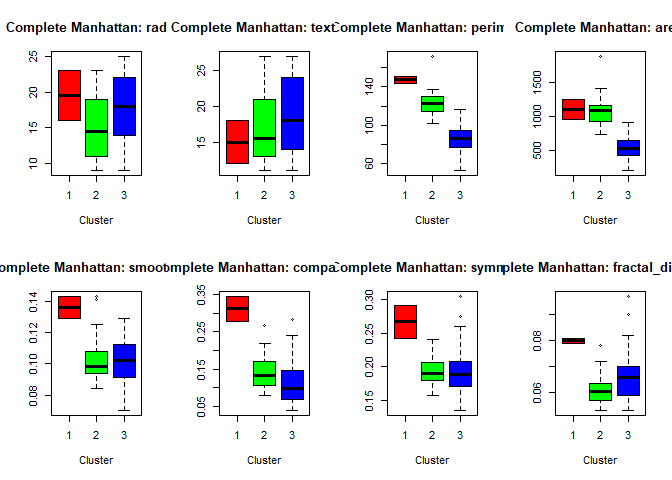

``` r
plot_cluster_boxplots(
  cluster_ward_euclidean,
  "Ward.D2:"
)
```

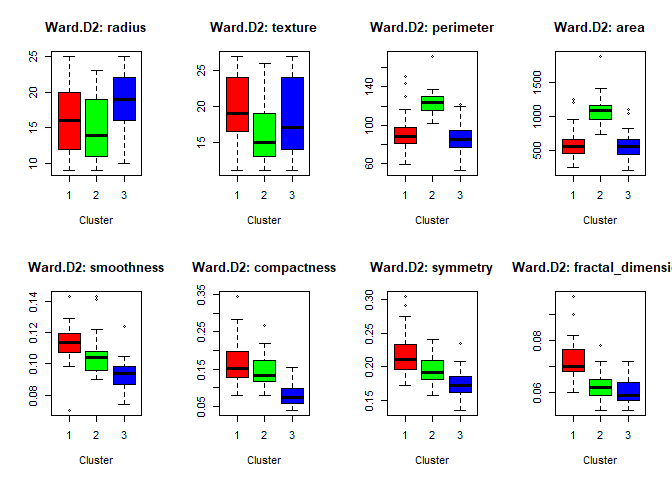

## K-means clustering

The original three-cluster analysis is retained. `set.seed()` and
multiple starts make the solution reproducible and reduce dependence on
one random initialization.

``` r
set.seed(125)
fviz_nbclust(
  standardised_data,
  kmeans,
  method = "wss",
  k.max = 10,
  nstart = 100
)
```

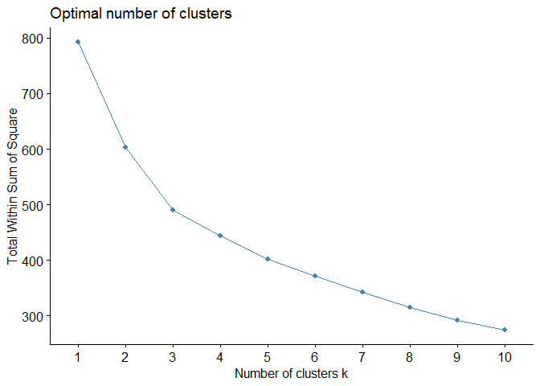

``` r
set.seed(125)
kmeans_model <- kmeans(
  standardised_data,
  centers = 3,
  iter.max = 100,
  nstart = 100
)

table(kmeans_model$cluster)
```


     1  2  3 
    27 42 31 

``` r
table(
  Cluster = kmeans_model$cluster,
  Diagnosis = prostate$diagnosis_result
)
```

           Diagnosis
    Cluster Benign Malignant
          1      2        25
          2     28        14
          3      8        23

``` r
kmeans_model$centers
```

            radius     texture  perimeter       area smoothness compactness
    1 -0.417123610 -0.28678462  1.1762766  1.2878811  0.1449179   0.3612020
    2  0.274738766 -0.07180059 -0.6423600 -0.6027737 -0.6320152  -0.8118618
    3 -0.008925507  0.34705838 -0.1542049 -0.3050417  0.7300598   0.7853465
         symmetry fractal_dimension
    1 -0.03078697        -0.4003417
    2 -0.63662661        -0.4661583
    3  0.88934083         0.9802539

``` r
plot_cluster_boxplots(kmeans_model$cluster, "K-means:")
```

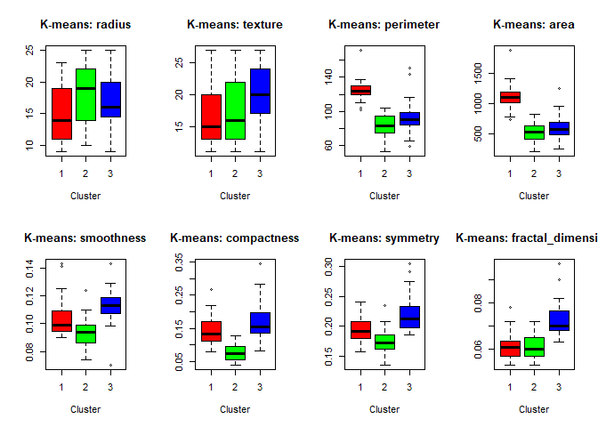

## Gap statistic

``` r
set.seed(125)
gap_statistic <- clusGap(
  standardised_data,
  FUNcluster = kmeans,
  K.max = 8,
  B = 100,
  nstart = 50
)

fviz_gap_stat(gap_statistic)
```

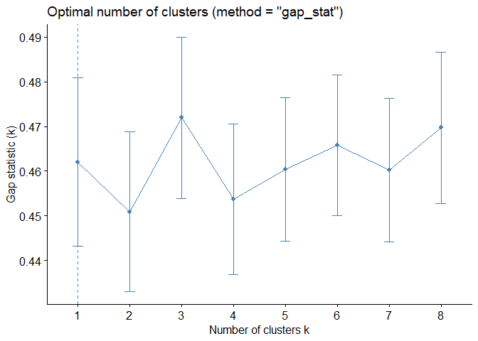

## Model-based clustering

``` r
set.seed(125)
model_based <- Mclust(standardised_data, G = 2:6, verbose = FALSE)

plot(model_based, what = "BIC")
```

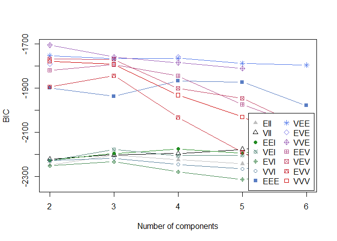

``` r
summary(model_based)
```

    ---------------------------------------------------- 
    Gaussian finite mixture model fitted by EM algorithm 
    ---------------------------------------------------- 

    Mclust VVE (ellipsoidal, equal orientation) model with 2 components: 

     log-likelihood   n df      BIC       ICL
          -711.9821 100 61 -1704.88 -1709.322

    Clustering table:
     1  2 
    42 58 

``` r
table(model_based$classification)
```


     1  2 
    42 58 

``` r
table(
  Cluster = model_based$classification,
  Diagnosis = prostate$diagnosis_result
)
```

           Diagnosis
    Cluster Benign Malignant
          1     14        28
          2     24        34

## Principal component analysis

PCA uses the already standardised variables, so no second
standardisation is applied.

``` r
pca_model <- princomp(standardised_data, cor = FALSE)
summary(pca_model)
```

    Importance of components:
                              Comp.1    Comp.2    Comp.3    Comp.4     Comp.5
    Standard deviation     1.6953684 1.4222242 0.9902818 0.9269721 0.78226580
    Proportion of Variance 0.3629134 0.2553941 0.1238205 0.1084946 0.07726512
    Cumulative Proportion  0.3629134 0.6183075 0.7421280 0.8506226 0.92788773
                               Comp.6     Comp.7      Comp.8
    Standard deviation     0.64463787 0.37432145 0.124316771
    Proportion of Variance 0.05246944 0.01769148 0.001951346
    Cumulative Proportion  0.98035717 0.99804865 1.000000000

``` r
plot_clusters_on_pca <- function(cluster, title) {
  plot(
    pca_model$scores[, 1],
    pca_model$scores[, 2],
    type = "n",
    xlab = "First principal component",
    ylab = "Second principal component",
    main = title
  )
  text(
    pca_model$scores[, 1],
    pca_model$scores[, 2],
    labels = cluster,
    col = cluster
  )
}

par(mfrow = c(3, 2))
plot_clusters_on_pca(
  cluster_complete_manhattan,
  "Complete linkage: Manhattan"
)
plot_clusters_on_pca(
  cluster_ward_euclidean,
  "Ward.D2: Euclidean"
)
plot_clusters_on_pca(
  cluster_complete_euclidean,
  "Complete linkage: Euclidean"
)
plot_clusters_on_pca(kmeans_model$cluster, "K-means")
plot_clusters_on_pca(model_based$classification, "Model-based")
plot(
  pca_model$scores[, 1],
  pca_model$scores[, 2],
  col = prostate$diagnosis_result,
  pch = 19,
  xlab = "First principal component",
  ylab = "Second principal component",
  main = "Reference diagnosis"
)
```

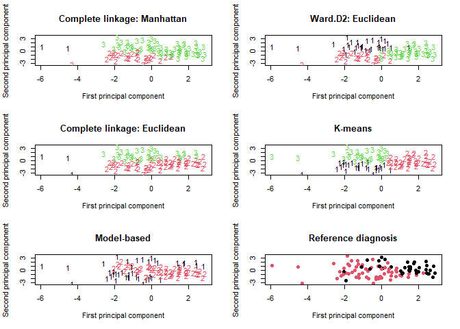

``` r
par(mfrow = c(1, 1))
```

``` r
biplot(pca_model, choices = c(1, 2), xlabs = prostate$id, cex = 0.6)
```

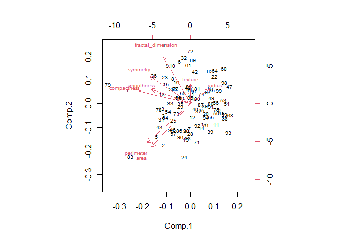

``` r
loadings <- pca_model$loadings[, 1:4]
loadings_data <- as.data.frame(loadings)
loadings_data$Variable <- rownames(loadings_data)
loadings_long <- melt(loadings_data, id.vars = "Variable")

ggplot(
  loadings_long,
  aes(x = Variable, y = value, fill = variable)
) +
  geom_col(position = "dodge") +
  theme_minimal() +
  theme(axis.text.x = element_text(angle = 45, hjust = 1)) +
  labs(
    title = "PCA loadings",
    x = "Variable",
    y = "Loading",
    fill = "Component"
  )
```

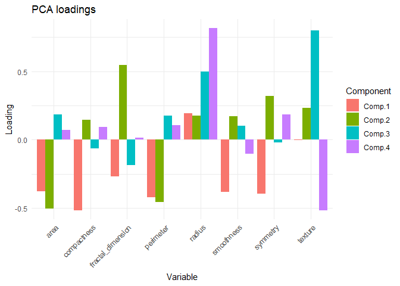

## Internal evaluation

`eclust()` receives `k = 3` explicitly. Silhouette widths are calculated
with the distance appropriate to each method.

``` r
set.seed(125)
eclust_kmeans <- eclust(
  standardised_data,
  FUNcluster = "kmeans",
  k = 3,
  nstart = 100,
  graph = FALSE
)

eclust_ward_euclidean <- eclust(
  standardised_data,
  FUNcluster = "hclust",
  k = 3,
  hc_metric = "euclidean",
  hc_method = "ward.D2",
  graph = FALSE
)

eclust_complete_manhattan <- eclust(
  standardised_data,
  FUNcluster = "hclust",
  k = 3,
  hc_metric = "manhattan",
  hc_method = "complete",
  graph = FALSE
)

model_based_silhouette <- silhouette(
  model_based$classification,
  euclidean_distance
)

internal_evaluation <- data.frame(
  Method = c(
    "K-means",
    "Model-based",
    "Ward.D2 Euclidean",
    "Complete Manhattan"
  ),
  Average_Silhouette = c(
    eclust_kmeans$silinfo$avg.width,
    mean(model_based_silhouette[, "sil_width"]),
    eclust_ward_euclidean$silinfo$avg.width,
    eclust_complete_manhattan$silinfo$avg.width
  )
)

internal_evaluation[order(-internal_evaluation$Average_Silhouette), ]
```

                  Method Average_Silhouette
    1            K-means          0.2176502
    4 Complete Manhattan          0.2124461
    3  Ward.D2 Euclidean          0.2007392
    2        Model-based          0.1143713

## Agreement between clustering solutions

Adjusted Rand Index and normalized mutual information are invariant to
cluster-label permutations.

``` r
normalised_mutual_information <- function(first_partition,
                                          second_partition) {
  contingency <- table(first_partition, second_partition)
  joint_probability <- contingency / sum(contingency)
  first_probability <- rowSums(joint_probability)
  second_probability <- colSums(joint_probability)

  row_probability <- first_probability[row(joint_probability)]
  column_probability <- second_probability[col(joint_probability)]
  nonzero <- joint_probability > 0

  mutual_information <- sum(
    joint_probability[nonzero] *
      log(
        joint_probability[nonzero] /
          (row_probability[nonzero] * column_probability[nonzero])
      )
  )

  first_entropy <- -sum(
    first_probability[first_probability > 0] *
      log(first_probability[first_probability > 0])
  )
  second_entropy <- -sum(
    second_probability[second_probability > 0] *
      log(second_probability[second_probability > 0])
  )

  mutual_information / sqrt(first_entropy * second_entropy)
}

method_comparison <- data.frame(
  Comparison = c(
    "Ward.D2 Euclidean vs K-means",
    "Complete Manhattan vs K-means",
    "Model-based vs K-means"
  ),
  Adjusted_Rand_Index = c(
    adjustedRandIndex(cluster_ward_euclidean, kmeans_model$cluster),
    adjustedRandIndex(cluster_complete_manhattan, kmeans_model$cluster),
    adjustedRandIndex(model_based$classification, kmeans_model$cluster)
  ),
  Normalised_Mutual_Information = c(
    normalised_mutual_information(
      cluster_ward_euclidean,
      kmeans_model$cluster
    ),
    normalised_mutual_information(
      cluster_complete_manhattan,
      kmeans_model$cluster
    ),
    normalised_mutual_information(
      model_based$classification,
      kmeans_model$cluster
    )
  )
)

method_comparison
```

                         Comparison Adjusted_Rand_Index
    1  Ward.D2 Euclidean vs K-means           0.7986335
    2 Complete Manhattan vs K-means           0.4635705
    3        Model-based vs K-means           0.2092699
      Normalised_Mutual_Information
    1                     0.7353906
    2                     0.5782728
    3                     0.1992846

## External comparison with diagnosis

Diagnosis is not used to construct clusters. The following values
measure agreement only; they are not supervised classification error
rates.

``` r
external_evaluation <- data.frame(
  Method = c(
    "K-means",
    "Model-based",
    "Ward.D2 Euclidean",
    "Complete Manhattan"
  ),
  Adjusted_Rand_Index = c(
    adjustedRandIndex(kmeans_model$cluster, prostate$diagnosis_result),
    adjustedRandIndex(model_based$classification, prostate$diagnosis_result),
    adjustedRandIndex(cluster_ward_euclidean, prostate$diagnosis_result),
    adjustedRandIndex(cluster_complete_manhattan, prostate$diagnosis_result)
  ),
  Normalised_Mutual_Information = c(
    normalised_mutual_information(
      kmeans_model$cluster,
      prostate$diagnosis_result
    ),
    normalised_mutual_information(
      model_based$classification,
      prostate$diagnosis_result
    ),
    normalised_mutual_information(
      cluster_ward_euclidean,
      prostate$diagnosis_result
    ),
    normalised_mutual_information(
      cluster_complete_manhattan,
      prostate$diagnosis_result
    )
  )
)

external_evaluation[order(-external_evaluation$Adjusted_Rand_Index), ]
```

                  Method Adjusted_Rand_Index Normalised_Mutual_Information
    1            K-means         0.137014722                   0.175177649
    3  Ward.D2 Euclidean         0.080129702                   0.126764531
    4 Complete Manhattan         0.067995980                   0.176413202
    2        Model-based        -0.009249493                   0.005009049

## Cluster descriptions

Cluster summaries are reported on the original measurement scale. They
describe relative feature levels and do not justify clinical claims
about aggressiveness or prognosis.

``` r
cluster_profiles <- original_scale_data |>
  mutate(Cluster = factor(kmeans_model$cluster)) |>
  group_by(Cluster) |>
  summarise(
    across(all_of(clustering_variables), mean),
    Observations = n(),
    .groups = "drop"
  )

cluster_profiles
```

    # A tibble: 3 x 10
      Cluster radius texture perimeter  area smoothness compactness symmetry
      <fct>    <dbl>   <dbl>     <dbl> <dbl>      <dbl>       <dbl>    <dbl>
    1 1         14.8    16.7     125.  1115.     0.105       0.146     0.192
    2 2         18.2    17.9      81.6  510.     0.0935      0.0764    0.174
    3 3         16.8    20.0      93.1  605.     0.113       0.171     0.221
    # i 2 more variables: fractal_dimension <dbl>, Observations <int>

## Sensitivity analysis: standard versus robust scaling

Potential outliers are retained. To examine their influence without mean
replacement, K-means and Ward.D2 are repeated after median/IQR scaling.

``` r
robust_scale <- function(x) {
  scale_value <- IQR(x)
  if (scale_value == 0) scale_value <- mad(x)
  (x - median(x)) / scale_value
}

robustly_scaled_data <- as.data.frame(
  lapply(original_scale_data, robust_scale)
)

set.seed(125)
kmeans_robust <- kmeans(
  robustly_scaled_data,
  centers = 3,
  iter.max = 100,
  nstart = 100
)

ward_robust <- hclust(
  dist(robustly_scaled_data, method = "euclidean"),
  method = "ward.D2"
)
cluster_ward_robust <- cutree(ward_robust, k = 3)

scaling_sensitivity <- data.frame(
  Method = c("K-means", "Ward.D2 Euclidean"),
  ARI_standard_vs_robust = c(
    adjustedRandIndex(kmeans_model$cluster, kmeans_robust$cluster),
    adjustedRandIndex(cluster_ward_euclidean, cluster_ward_robust)
  ),
  NMI_standard_vs_robust = c(
    normalised_mutual_information(
      kmeans_model$cluster,
      kmeans_robust$cluster
    ),
    normalised_mutual_information(
      cluster_ward_euclidean,
      cluster_ward_robust
    )
  )
)

scaling_sensitivity
```

                 Method ARI_standard_vs_robust NMI_standard_vs_robust
    1           K-means              0.9255663              0.9093420
    2 Ward.D2 Euclidean              0.7201573              0.7164771

## Conclusion

The original sequence—exploration, hierarchical clustering, K-means,
model-based clustering, PCA, silhouette analysis, gap statistic, and
comparison with diagnosis—is retained. The corrections preserve
continuous measurements, avoid Ward clustering with Manhattan distance,
make random initialization reproducible, create every referenced object,
report computed rather than copied silhouette values, use ARI/NMI for
external agreement, and assess outlier sensitivity without manufacturing
observations through mean replacement.
